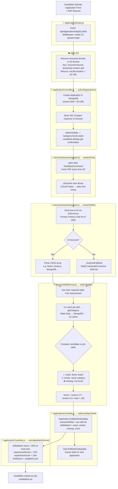
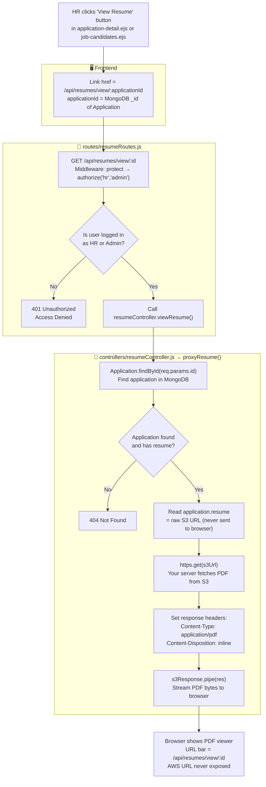
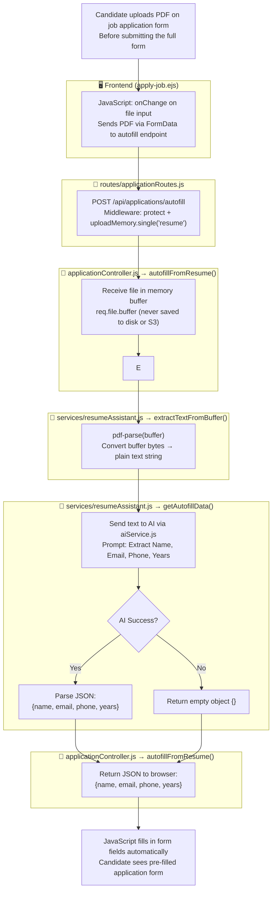
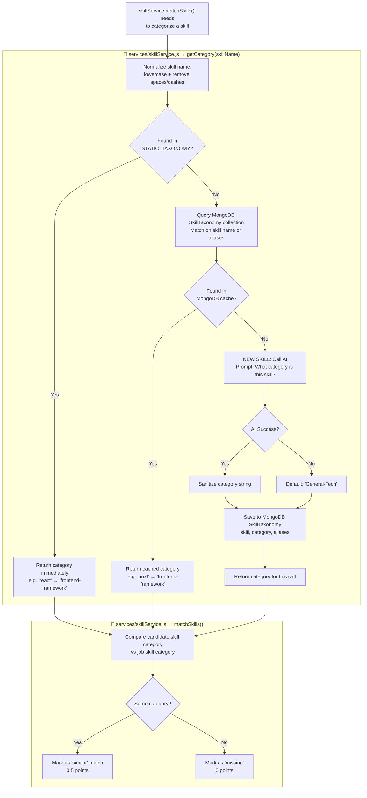

# Flow 10: AI Resume Parsing & Match Scoring

## Overview
When a candidate submits a job application with a resume (PDF), the system automatically parses it in the background using AI to extract skills and calculate a **Skill Match Score**. This score accounts for **20% of the final candidate ranking**.

---

## Architecture Diagram



---

## Step-by-Step Breakdown

| Step | File | Function | What Happens |
|:-----|:-----|:---------|:-------------|
| 1 | `applicationRoutes.js` | Route Middleware | `multer-s3` intercepts request, streams PDF directly to AWS S3 |
| 2 | `applicationController.js` | `submitApplication()` | Saves Application with `resume = S3 URL`, sends 201 response to browser |
| 3 | `applicationController.js` | `setImmediate()` block | Background job starts — candidate already got confirmation |
| 4 | `resumeAssistant.js` | `extractText()` | AWS SDK `GetObjectCommand` fetches PDF bytes from S3 → `pdf-parse` converts to text |
| 5 | `resumeAssistant.js` | `extractSkills()` | AI reads text → returns `["React", "Node.js", "MongoDB", ...]` |
| 5b | `resumeAssistant.js` | `_keywordFallback()` | Runs if AI fails — matches text against hardcoded common skills list |
| 6 | `skillService.js` | `matchSkills()` | Compares candidate skills vs job's required skills |
| 7 | `skillService.js` | `getCategory()` | Classifies each skill → checks Static Map → MongoDB cache → AI (saves result) |
| 8 | `applicationController.js` | `setImmediate()` block | Saves `skillsMatch` (exact/similar/missing/score) to Application document |
| 9 | `applicationController.js` | `calculateMatchScore()` | Uses `skillsMatch.score` as the 20% signal in the final ranking formula |

---

## Skill Matching Logic

```
Job requires: ["React", "Docker", "MongoDB"]
Candidate has: ["Vue.js", "MongoDB", "Python"]

Exact Match:   MongoDB           → 1.0 point
Similar Match: Vue.js vs React  → 0.5 point  (both = frontend-framework)
Missing:       Docker           → 0 points

Score = (1 × 1.0 + 1 × 0.5) / 3 × 100 = 50%
```

---

## Data Stored in MongoDB

### In `Application` document:
```json
{
  "resume": "https://s3.amazonaws.com/bucket/resumes/resume-1710123456.pdf",
  "extractedSkills": ["React", "Node.js", "MongoDB"],
  "skillsMatch": {
    "exact":   ["MongoDB"],
    "similar": ["Vue.js (vs React)"],
    "missing": ["Docker"],
    "score":   50
  }
}
```

### In `User` document (cache for next application):
```json
{
  "parsedResumeData": {
    "skills": ["React", "Node.js", "MongoDB"],
    "lastParsed": "2026-03-15T12:00:00Z"
  }
}
```

---

---

# Flow 11: Secure Resume Viewing (HR Proxy)

## Overview
When HR clicks "View Resume", the resume is **proxied through the backend** — HR never sees the raw AWS S3 URL. A valid session is required to access it.

---

## Architecture Diagram



---

## Step-by-Step Breakdown

| Step | File | Function | What Happens |
|:-----|:-----|:---------|:-------------|
| 1 | `application-detail.ejs` | Template | HR sees "View Resume" button linking to `/api/resumes/view/:applicationId` |
| 2 | `resumeRoutes.js` | Route | `protect` checks JWT cookie → `authorize('hr','admin')` checks role |
| 3 | `resumeController.js` | `proxyResume()` | Looks up Application by ID in MongoDB → reads `resume` field (S3 URL) |
| 4 | `resumeController.js` | `proxyResume()` | Node.js `https.get()` fetches PDF bytes from S3 on the server side |
| 5 | `resumeController.js` | `proxyResume()` | Sets `Content-Disposition: inline` → streams bytes to browser via `.pipe(res)` |
| 6 | Browser | — | PDF opens in browser tab, URL shows your project domain (not AWS) |

---

## Key Security Points
- The raw S3 URL is **only ever read on the server** — never sent to the browser
- Unauthenticated requests → **401 blocked** before the controller even runs
- Candidates cannot view other candidates' resumes (HR/Admin only route)
- Download variant: `GET /api/resumes/download/:id` → same flow but `Content-Disposition: attachment`

---

---

# Flow 12: Candidate Autofill (PDF → Form Pre-fill)

## Overview
When a candidate uploads a resume on the application form, the system parses it in real-time using AI and **automatically fills in** their Name, Email, Phone, and Years of Experience fields.

---

## Architecture Diagram



---

## Step-by-Step Breakdown

| Step | File | Function | What Happens |
|:-----|:-----|:---------|:-------------|
| 1 | `apply-job.ejs` | JS Event Listener | `onChange` fires when candidate picks a PDF file |
| 2 | `applicationRoutes.js` | `uploadMemory` middleware | File loaded into RAM buffer — **NOT uploaded to S3** |
| 3 | `applicationController.js` | `autofillFromResume()` | Receives `req.file.buffer` |
| 4 | `resumeAssistant.js` | `extractTextFromBuffer()` | `pdf-parse(buffer)` converts bytes directly to plain text |
| 5 | `resumeAssistant.js` | `getAutofillData()` | AI reads text → returns `{name, email, phone, years}` |
| 6 | `applicationController.js` | `autofillFromResume()` | Returns JSON to browser |
| 7 | `apply-job.ejs` | JS | Fills form fields: name, email, phone, yearsExperience automatically |

> **Note**: The autofill PDF is only in RAM — it is **not saved anywhere**. The actual upload to S3 happens only when the full form is submitted.

---

---

# Flow 13: Skill Taxonomy & AI Categorization

## Overview
To enable **"similar skill" matching** (e.g., Vue.js accepted when React is required), the system categorizes every skill into a group. If a skill is new/unknown, AI classifies it and the result is saved to MongoDB so it's never re-classified again.

---

## Architecture Diagram



---

## Step-by-Step Breakdown

| Step | File | Function | What Happens |
|:-----|:-----|:---------|:-------------|
| 1 | `skillService.js` | `getCategory()` | Normalize skill name (lowercase, strip spaces/dashes) |
| 2 | `skillService.js` | `getCategory()` | Check `STATIC_TAXONOMY` — a hardcoded map of 30+ known skills |
| 3 | `skillService.js` | `getCategory()` | If not found, query `SkillTaxonomy` MongoDB collection |
| 4 | `skillService.js` | `getCategory()` | If still not found, call AI via `aiService.js` |
| 5 | `skillService.js` | `getCategory()` | Save AI result to `SkillTaxonomy` (never re-classified again) |
| 6 | `skillService.js` | `matchSkills()` | Use category to decide `similar` vs `missing` |

---

## Static Taxonomy (Hardcoded)

| Category | Skills |
|:---|:---|
| `frontend-framework` | react, vue, angular, svelte, nextjs, nuxt |
| `backend-framework` | express, nestjs, fastify, django, flask, laravel |
| `database` | mongodb, postgresql, mysql, redis, sqlite |
| `programming-language` | javascript, typescript, python, java, golang, rust |
| `cloud-devops` | aws, azure, docker, kubernetes, jenkins, terraform |

## MongoDB SkillTaxonomy Document

```json
{
  "skill": "figma",
  "category": "UI-UX",
  "aliases": ["figma"],
  "createdAt": "2026-03-15T12:00:00Z"
}
```
