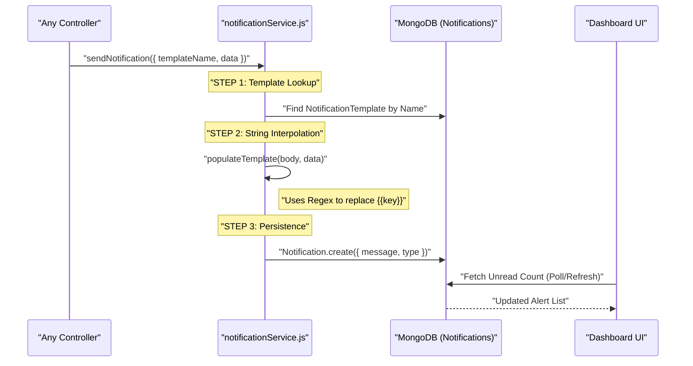
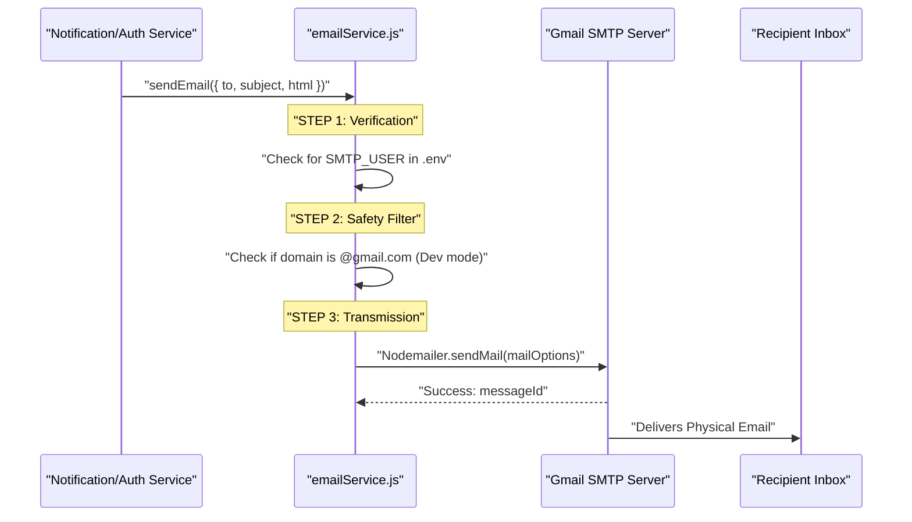
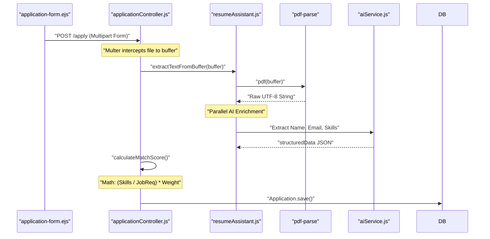
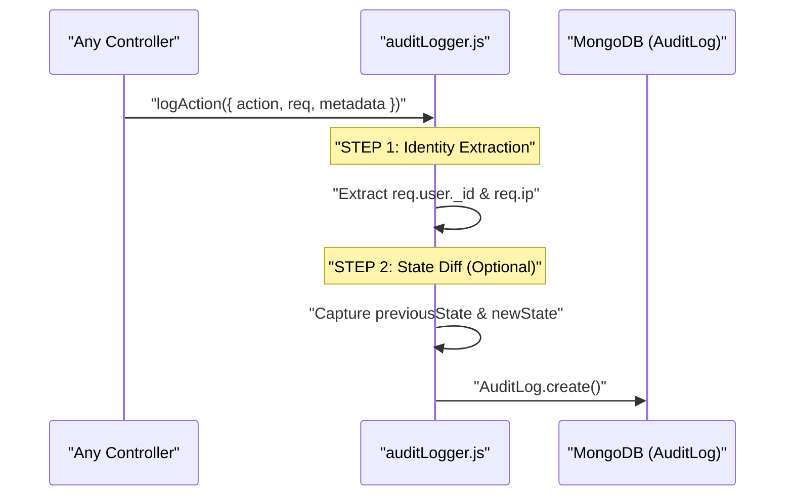

# Microscopic System Flows

This document provides a low-level, file-to-file view of how the most critical services in ScenarioSim operate. Use these as a map for debugging or extending features.

---

## 1. Notification Flow (In-App)
Handles the creation and delivery of real-time alerts inside the HR and Candidate dashboards.

### 🎬 Sequence Diagram


### 🔬 Files & Methods
- **Service**: `backend/services/notificationService.js` -> `sendNotification()`
- **Model (Storage)**: `backend/models/Notification.js`
- **Model (Blueprints)**: `backend/models/NotificationTemplate.js`
- **Controller**: `backend/controllers/notificationController.js` (For fetching/marking as read)

---

## 2. Email Dispatch Flow
The standalone engine for sending external communications via SMTP.

### 🎬 Sequence Diagram


### 🔬 Files & Methods
- **Service**: `backend/services/emailService.js`
- **Configuration**: `backend/.env` (`SMTP_USER`, `SMTP_PASS`)
- **Key Method**: `nodemailer.createTransport()` (Initializes connection)

---

## 3. Resume Parsing & Application Flow
How a raw applicant becomes a scoped candidate with a profile.

### 🎬 Sequence Diagram


### 🔬 Files & Methods
- **Service**: `backend/services/resumeAssistant.js`
- **Dependency**: `pdf-parse` (Inbuilt method `pdf()`)
- **Controller**: `backend/controllers/applicationController.js` -> `applyToJob()`

---

## 4. Audit Logging (System History)
Every critical action leaves a permanent trail here.

### 🎬 Sequence Diagram


### 🔬 Files & Methods
- **Utility**: `backend/utils/auditLogger.js` -> `logAction()`
- **Model**: `backend/models/AuditLog.js` (Defines `entityType` and `action`)

---

## 5. Global Leaderboard & Scoring
The mathematical engine behind candidate rankings.

### 🎬 Logic Map
*   **Base Score**: (Years Experience / Min Required) * 100 [Capped at 100]
*   **Skill Match**: (Resume Skills ∩ Job Skills) / Total Required * 100
*   **Simulation Score**: Dynamic HSL calculation from AI Dojo.
*   **Final Aggregate**:
    *   `Experience * 0.15`
    *   `SkillMatch * 0.10`
    *   `Technical * 0.40`
    *   `Soft Skills * 0.35`

### 🔬 Files & Methods
- **Score Logic**: `backend/controllers/applicationController.js` -> `calculateMatchScore()`
- **Ranking Weights**: Stored in `Job` model (`rankingWeights` map).

---

## 6. Authentication & JWT Safety
How the system identifies you across sessions.

### 🎬 Sequence Diagram
```mermaid
sequenceDiagram
    participant FE as "Browser/UI"
    participant AC as "authController.js"
    participant DB as "MongoDB (Users)"
    participant MW as "authMiddleware.js"

    FE->>AC: "POST /login { email, password }"
    AC->>DB: "Find User & Select +password"
    
    Note over AC: "BCrypt.compare(input, hashed)"
    
    AC->>AC: "user.getSignedJwtToken()"
    Note right of AC: "Token contains { id, role }"
    
    AC-->>FE: "Set-Cookie: token=JWT; HttpOnly"

    Note over FE, MW: "Future Requests"
    FE->>MW: "HTTP Request + Cookie"
    MW->>MW: "JWT.verify(token)"
    MW-->>FE: "Forbidden (if invalid)"
```

### 🔬 Files & Methods
- **Controller**: `backend/controllers/authController.js`
- **Model Logic**: `backend/models/User.js` (`matchPassword`, `getSignedJwtToken`)
- **Security Guard**: `backend/middleware/auth.js` (`protect`, `authorize`)
